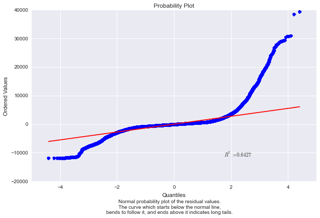
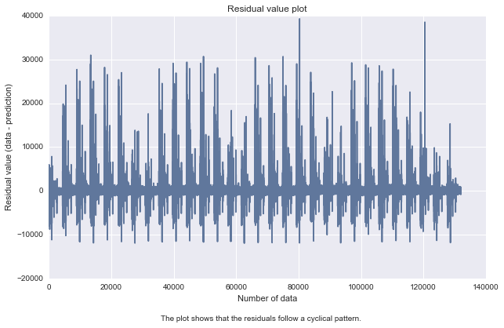
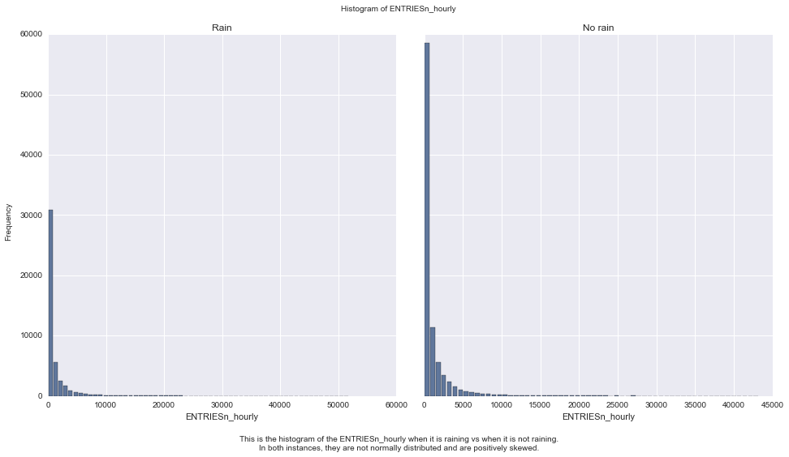

# NYC Subway Data Analysis

This project look at the NYC Subway data and figure out if more people ride the subway when it is raining versus when it is not raining.

The data can be found at:

* Original data set at: <https://www.dropbox.com/s/meyki2wl9xfa7yk/turnstile_data_master_with_weather.csv>
* Improved data set at: <https://www.dropbox.com/s/1lpoeh2w6px4diu/improved-dataset.zip?dl=0>

## 0. References

* Frost, Jim. Choosing Between a Nonparametric Test and a Parametric Test. <http://blog.minitab.com/blog/adventures-in-statistics/choosing-between-a-nonparametric-test-and-a-parametric-test>
* SPSS tutorial. Mann-Whitney U Test using SPS. <https://statistics.laerd.com/spss-tutorials/mann-whitney-u-test-using-spss-statistics.php>
* Frost, Jim. Regression Analysis: How Do I Interpret R-squared and Assess the Goodness-of-Fit? <http://blog.minitab.com/blog/adventures-in-statistics/regression-analysis-how-do-i-interpret-r-squared-and-assess-the-goodness-of-fit>
* NIST. Are the model residuals well-behaved? <http://www.itl.nist.gov/div898/handbook/pri/section2/pri24.htm>
* OriginLab. Graphic Residual Analysis. <http://www.originlab.com/doc/Origin-Help/Residual-Plot-Analysis>
* Graphpad. One-tail vs. two-tail P values. <http://graphpad.com/guides/prism/6/statistics/index.htm?one-tail_vs__two-tail_p_values.htm>
* Skymark.com. Normal Test Plot. <http://www.skymark.com/resources/tools/normal_test_plot.asp>

## 1. Statistical Analysis

I divided the dataset into two samples, entries per hour when it is raining vs when it is not raining and then perform inferential statistic on them.

### 1.1 Statistical test

#### Statistical test

I perform Mann-Whitney U test on the two samples.

#### One-tail vs Two-tail

I am performing a two-tail P value.

#### Hypothesis

*The null hypothesis is:*

The distributions of both groups are identical, so that there is a 50% probability that an observation from a value randomly selected from one population exceeds an observation randomly selected from the other population.

P(x > y) = 0.5

*Alternative hypothesis:*

The distributions of both groups are not identical, the probability that an observation from a value randomly selected from one population exceeds an observation randomly selected from the other population is not 50%.

P(x > y) != 0.5 

#### Critical value

I use .05 as p-critical value.

### 1.2 Reasoning

I am using this test because the samples is non-normal. Generally, we use Mann-Whitney U test, if it follow several assumptions:

* The dependent variable is ordinal or continous
* The independent variable (with rain, without rain) is 2 categorical data
* There is no relationship between the observations in each group or between the groups themselves
* The two variables are not normaly distributed

### 1.3 Result

Calculating the Mann-Whitney U test I got:

u value of **1924409167.0** and p-value of  **0.049999825587**

Some descriptive statistics regarding our two samples.

           With rain summary  Without rain summary
    count       44104.000000          87847.000000
    mean         1105.446377           1090.278780
    std          2370.527674           2320.004938
    min             0.000000              0.000000
    25%            41.000000             38.000000
    50%           282.000000            278.000000
    75%          1103.250000           1111.000000
    max         51839.000000          43199.000000
    
### 1.4 Intrepretation

Since our p-value of 0.049999825587 is < 0.05 our critical value.
We conclude that there is statistically significant difference between the distributions of the two sample. This results are significant at the .05 level.

## 2. Linear regression

### 2.1 Approach
To compute the coefficients theta and produce prediction for ENTRIESn_hourly in the regression model I choose to use OLS using Statsmodels.

### 2.2 Features
I use the following features:

**rain, precipi, meantempi, fog, meanwindspi, Hour**

In addition to this, I have added dummy variables 'UNIT' for the features.

### 2.3 Reason behind features

I am interested in several features and I choose to play around with combination of several of the following features:

* rain : I think people will decide to ride the subway if it is raining
* precipi : same with the above, it includes snow, drizzle, hail, etc.
* meantempi : I think people will ride the subway more if it is cold
* fog : I think people will ride the subway more if it is fogging, it is probably not fun to drive
* meanwindspi: If it is windy, people who use bike or walk might opt to take subway
* Hour : People tend to ride subway on certain hour, for example to get to or back from work.

I create combinations out of these feature, compute the predictions and the R^2 value for each combination and use the best. I aim to have R^2 score of 0.40 or better. 

In total there are 63 combinations, all of them has R^2 > 0.40.

### 2.4 Parameters

The coefficients for the model is:
 
* Intercept: **1081.87869019**
* Non-dummy Parameters: **[ -32.26725174   -5.91215877  120.27580878   26.27992382  -22.61805652 67.39739472]**

### 2.5 R^2

The R^2 value is **0.458621326664**

### 2.6 Intrepretation

To check if the R^2 is fit for the regresion model. I do some analysis on the residual.
First I plot the residuals histogram as follow:

The histogram has long tails, which suggests that there are some very large residuals. To make sure I plot normal probably plot.

The plot confirms that we have long tails problem which means we are seeing more variance than we would expect in a normal distribution.

In fact if we simply plot the residual values we got:

It shows that there are some non-linearity in the data.
And this should be addressed by designing a non linear model.

In conclusion, we achieve a R^2 value that we set (> 0.40), but on further inspection we find out that the linear model is **not** appropriate to predict ridership.

## 3. Visualization

I present the following visualization for this project below.

### 3.1 Rainy days vs Non-rainy days histogram

### 3.2 Ridership throughout the day

## 4. Conclusion
Our statistical analysis shows that there is significant difference in ridership when it is raining vs when it is not raining.

We develop a model to predict the ridership. We used linear model (OLS) and achieve R^2 value that we set as the goal. However after analyzing the residual, we find that the model is not appropriate to predict the ridership. 

## 5. Reflection

